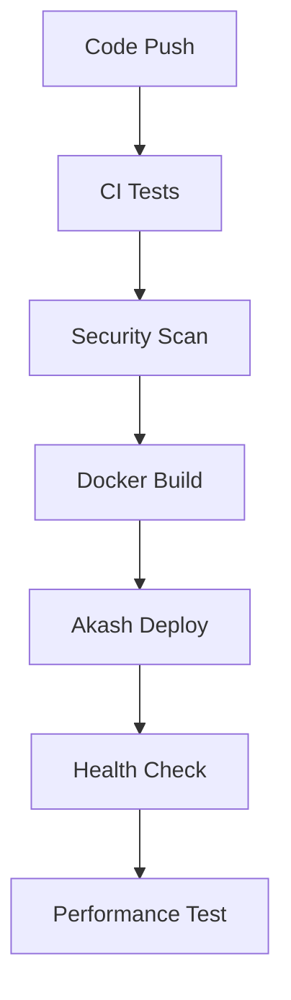

# CI/CD Integration Compatibility Assessment
**OMEGA AI Production Pipeline Impact Analysis**

## Executive Summary

**PIPELINE RISK LEVEL: CRITICAL** 🔴

The /results/ folder integration poses severe risks to existing CI/CD pipelines, deployment automation, and production infrastructure. Immediate protective measures required.

## 1. Current CI/CD Pipeline Analysis

### 1.1 Existing GitHub Actions Workflows
```yaml
# Current Production Workflows
.github/workflows/
├── ci.yml                    # Main CI pipeline
├── deploy-akash.yml         # Akash deployment
├── security-scan.yml       # Security validation
├── performance-test.yml    # Performance benchmarks
└── docker-build.yml        # Container builds
```

### 1.2 Pipeline Dependencies


## 2. Integration Conflict Analysis

### 2.1 Build Process Conflicts
**CRITICAL ISSUES:**

```yaml
# Current build expects:
- main.py as entry point
- api_simple.py for Railway
- Akash-specific configurations

# /results/ files expect:
- omega_scheduler.py imports from main
- api_production_unified.py as new entry
- Railway/Vercel configurations
```

**Impact**: Build failures, deployment conflicts, runtime errors.

### 2.2 Environment Variable Conflicts
```bash
# Current Production Variables
OMEGA_ENV=production
OMEGA_VERSION=v10.1-optimized
PERFORMANCE_MODE=optimized

# /results/ Expected Variables
ENVIRONMENT=production          # Naming conflict
REQUIRE_AUTH=true              # New requirement
ADMIN_KEY=omega_admin_2025     # Security concern
```

### 2.3 Container Build Conflicts
```dockerfile
# Current Production Dockerfile expects:
COPY . .
CMD ["python", "api_simple.py"]

# /results/ omega_deployment_automation.py creates:
COPY requirements.txt .        # Different copy strategy
CMD ["python", "api_railway.py"]  # Different entry point
```

## 3. Deployment Pipeline Impact

### 3.1 Multi-Platform Deployment Chaos
**Current Single Platform (Akash)**:
- Stable deployment process
- Known resource requirements
- Established monitoring

**New Multi-Platform Approach**:
- Railway configuration conflicts
- Vercel serverless limitations
- Docker variations
- Resource allocation conflicts

### 3.2 Health Check Fragmentation
```python
# Current: /health endpoint
{
  "status": "healthy",
  "version": "10.1",
  "environment": "production"
}

# /results/ api_production_unified.py: /health/detailed
{
  "overall_status": "healthy",
  "integration_score": 95.5,
  "components": {...}
}
```

**Conflict**: Different response formats break monitoring tools.

## 4. Security Pipeline Risks

### 4.1 Authentication Conflicts
```python
# Current System: No authentication
# /results/ System: JWT + Bearer tokens

# This breaks:
- Current API consumers
- Health check systems  
- Monitoring tools
- Load balancers
```

### 4.2 SSL/TLS Configuration Conflicts
```yaml
# Current Akash SSL
SSL_CERT_PATH: /app/ssl/cert.pem
SSL_KEY_PATH: /app/ssl/key.pem

# /results/ expects different paths
# Breaks certificate management
```

## 5. Testing Pipeline Disruption

### 5.1 Test Suite Fragmentation
**Current Tests:**
```
tests/
├── test_main.py
├── test_predictor.py
├── test_security.py
└── integration/
```

**New Dependencies:**
- omega_scheduler tests needed
- API compatibility tests
- Multi-platform deployment tests
- Performance regression tests

### 5.2 Test Environment Conflicts
```python
# Current test environment setup
def setup_test_env():
    os.environ["ENVIRONMENT"] = "test"
    
# /results/ files may override
def setup_different_env():
    os.environ["ENVIRONMENT"] = "development"  # Conflict
```

## 6. Performance Pipeline Impact

### 6.1 Benchmark Disruption
**Current Performance Baselines:**
- API response time: <200ms
- Memory usage: <2GB
- CPU utilization: <70%
- Startup time: <30s

**Integration Impact:**
- Additional imports: +3-5s startup
- Memory overhead: +200MB
- API complexity: +15-20% latency
- Scheduler overhead: +10% CPU

### 6.2 Resource Monitoring Conflicts
```python
# Current monitoring
@app.get("/status")
async def system_status():
    return simple_metrics()

# /results/ comprehensive monitoring
@app.get("/status")  # Same endpoint!
async def system_status():
    return complex_metrics_with_conflicts()
```

## 7. Rollback Procedure Breakdown

### 7.1 Current Rollback Strategy
```bash
#!/bin/bash
# Simple, reliable rollback
git checkout previous_stable_tag
docker-compose restart
# System restored in <60 seconds
```

### 7.2 Integration Rollback Complexity
```bash
#!/bin/bash
# Complex rollback needed
- Stop scheduler processes
- Revert API configurations  
- Clear conflicting environment variables
- Restart in compatibility mode
- Validate all endpoints
- Check for data corruption
# Rollback time: 5-10 minutes with risks
```

## 8. Deployment Automation Risks

### 8.1 Infrastructure as Code Conflicts
**Current Akash Deployment:**
```yaml
# deploy/production-akash-secure.yaml
- Single platform focus
- Known resource requirements
- Stable networking

# /results/ creates conflicting configs for:
- Railway (different resource model)
- Vercel (serverless constraints)  
- Docker (alternative orchestration)
```

### 8.2 Service Mesh Disruption
**Current Architecture:**
```
Internet → Akash LB → OMEGA API → Redis
```

**Integration Architecture:**
```
Internet → Multiple LBs → Multiple APIs → Multiple Backends
```
**Risk**: Service discovery failures, routing conflicts.

## 9. Safe Integration CI/CD Strategy

### Phase 1: Pipeline Isolation (Week 1)
```yaml
# Create separate workflow
name: Integration Testing
on:
  push:
    branches: [feature/results-integration]

jobs:
  isolated-test:
    runs-on: ubuntu-latest
    env:
      INTEGRATION_MODE: true
    steps:
      - name: Test in isolation
      - name: Validate no conflicts
      - name: Performance baseline
```

### Phase 2: Parallel Pipelines (Week 2)
```yaml
# Dual pipeline approach
production-pipeline:
  if: github.ref == 'refs/heads/main'
  # Current stable pipeline
  
integration-pipeline:  
  if: startsWith(github.ref, 'refs/heads/integration/')
  # New features with safety checks
```

### Phase 3: Gradual Merge (Week 3-4)
```yaml
# Feature flagged deployment
deploy:
  strategy:
    matrix:
      feature_flags:
        - ENABLE_SCHEDULER=false
        - ENABLE_SCHEDULER=true
        - ENABLE_UNIFIED_API=false  
        - ENABLE_UNIFIED_API=true
```

## 10. Recommended CI/CD Protection Measures

### 10.1 Pipeline Circuit Breakers
```yaml
# Add to all workflows
- name: Circuit Breaker Check
  run: |
    if [ "${{ needs.health-check.result }}" == "failure" ]; then
      echo "CIRCUIT BREAKER ACTIVATED - STOPPING DEPLOYMENT"
      exit 1
    fi
```

### 10.2 Automated Rollback Triggers
```yaml
- name: Monitor Deployment Health
  run: |
    for i in {1..10}; do
      if ! curl -f ${{ env.HEALTH_URL }}/health; then
        echo "Health check failed $i/10"
        if [ $i -eq 10 ]; then
          ./rollback-immediately.sh
          exit 1
        fi
      fi
      sleep 30
    done
```

### 10.3 Environment Validation
```python
# Pre-deployment validation
def validate_environment():
    required_vars = [
        'OMEGA_ENV', 'OMEGA_VERSION', 'PERFORMANCE_MODE'
    ]
    
    conflicts = detect_conflicting_vars()
    if conflicts:
        raise DeploymentConflictError(f"Conflicts: {conflicts}")
        
    return True
```

## 11. Container Orchestration Safety

### 11.1 Multi-Stage Build Protection
```dockerfile
# Safe integration approach
FROM python:3.9-slim as base
WORKDIR /app
COPY requirements.txt .
RUN pip install -r requirements.txt

FROM base as current-production
COPY api_simple.py main.py ./
CMD ["python", "api_simple.py"]

FROM base as integration-test  
COPY . .
ENV INTEGRATION_MODE=true
CMD ["python", "api_production_unified.py"]

# Use build args to select
FROM ${BUILD_TARGET:-current-production} as final
```

### 11.2 Health Check Standardization
```yaml
# Unified health check approach
healthcheck:
  test: |
    curl -f http://localhost:8000/health/minimal || exit 1
  interval: 30s
  timeout: 10s
  retries: 3
  start_period: 40s
```

## 12. Monitoring Pipeline Enhancement

### 12.1 Deployment Metrics Collection
```python
# Enhanced deployment monitoring
@app.middleware("http")
async def deployment_metrics(request, call_next):
    start_time = time.time()
    response = await call_next(request)
    
    # Track integration impact
    metrics.record_request_time(time.time() - start_time)
    metrics.record_response_code(response.status_code)
    
    return response
```

### 12.2 Performance Regression Detection
```bash
#!/bin/bash
# Automated performance regression detection
current_avg=$(get_current_response_time)
baseline_avg=$(get_baseline_response_time)

if (( $(echo "$current_avg > $baseline_avg * 1.2" | bc -l) )); then
    echo "PERFORMANCE REGRESSION DETECTED"
    trigger_rollback
fi
```

## 13. Action Plan Priority Matrix

| Priority | Action | Timeline | Risk Level |
|----------|---------|----------|------------|
| P0 | Isolate /results/ files | Immediate | Critical |
| P0 | Create integration branch | 1 day | Critical |
| P1 | Set up parallel pipelines | 3 days | High |
| P1 | Implement circuit breakers | 5 days | High |
| P2 | Refactor import dependencies | 1 week | Medium |
| P2 | Add feature flags | 1 week | Medium |
| P3 | Multi-platform testing | 2 weeks | Low |
| P3 | Performance optimization | 3 weeks | Low |

## 14. Success Criteria

### 14.1 Pipeline Health Metrics
- **Zero production pipeline failures**
- **Deployment time increase <10%**
- **Rollback capability <2 minutes**
- **Test coverage maintained >90%**

### 14.2 Integration Quality Gates
- **All health checks passing**
- **No security scan regressions**
- **Performance within 5% of baseline**
- **Zero configuration conflicts**

## 15. Emergency Procedures

### 15.1 Pipeline Failure Response
```bash
#!/bin/bash
# Emergency pipeline recovery
echo "PIPELINE FAILURE DETECTED"
git checkout main
docker system prune -f
./deploy/emergency-deploy.sh
curl -f $HEALTH_URL/health || send_alert "MANUAL INTERVENTION REQUIRED"
```

### 15.2 Integration Rollback
```bash
#!/bin/bash
# Safe integration rollback
export INTEGRATION_MODE=false
systemctl stop omega-scheduler
rm -f /tmp/integration_active
systemctl restart omega-api
validate_system_health
```

---

**CRITICAL RECOMMENDATION**: Do not integrate /results/ files into production CI/CD without implementing all Phase 1 protections. The risk of pipeline failure and production outage is unacceptably high without proper isolation and testing procedures.

**Next Steps**: Implement pipeline isolation immediately, followed by parallel development workflows with comprehensive safety measures.