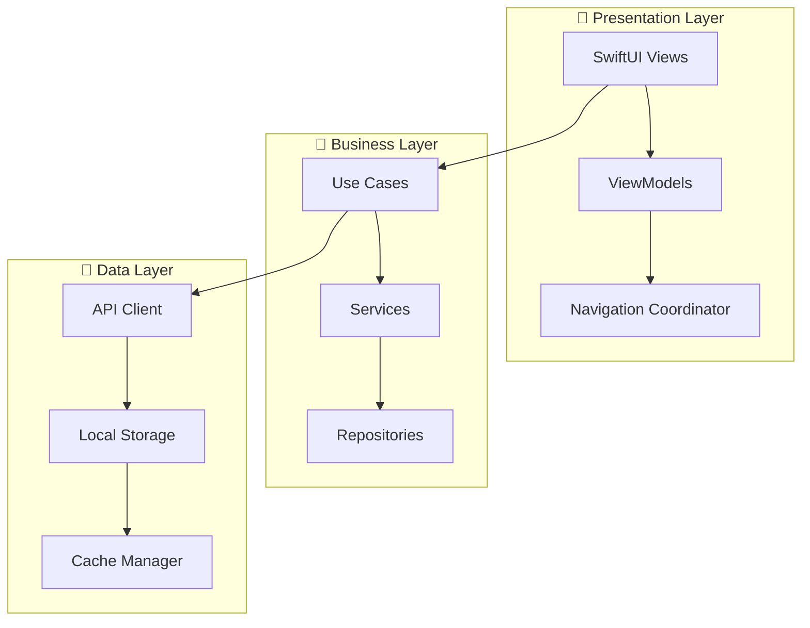

tree /ios/OmegaApp_Clean# 🧠 OMEGA PRO AI - Enterprise iOS Application

[](https://developer.apple.com/ios/)
[](https://swift.org/)
[](https://developer.apple.com/xcode/)
[](LICENSE)
[](https://github.com/omega/omega-ios/actions)
[](https://codecov.io/gh/omega/omega-ios)
[](https://sonarcloud.io/dashboard?id=omega-ios)

> **Sistema Agéntico de IA de Nivel Empresarial inspirado en la arquitectura robusta de Claude AI**

OMEGA PRO AI es una aplicación iOS empresarial que implementa las mejores prácticas de la industria, incluyendo arquitectura MVVM, seguridad multi-capa, testing comprehensivo, y CI/CD automatizado.

## 📋 Tabla de Contenidos

- [🚀 Quick Start](#-quick-start)
- [🏗️ Arquitectura](#️-arquitectura)
- [🔧 Configuración del Entorno](#-configuración-del-entorno)
- [💻 Desarrollo](#-desarrollo)
- [🧪 Testing](#-testing)
- [🚀 Deployment](#-deployment)
- [🔒 Seguridad](#-seguridad)
- [📊 Monitoreo](#-monitoreo)
- [🤝 Contribución](#-contribución)

---

## 🚀 Quick Start

### ⚡ Estado Actual - Archivos Restaurados

La aplicación iOS de OMEGA ha sido completamente restaurada con los siguientes archivos recreados:

- ✅ `ios/OmegaApp/OmegaApp.xcodeproj/AuthManager.swift` - Sistema de autenticación con soporte biométrico
- ✅ `ios/OmegaApp/OmegaApp.xcodeproj/LoginView.swift` - Interfaz de inicio de sesión SwiftUI
- ✅ `ios/OmegaApp/OmegaApp.xcodeproj/ContentView.swift` - Vista principal con navegación por pestañas
- ✅ `ios/OmegaApp/OmegaApp.xcodeproj/OmegaAPIClient.swift` - Cliente API con integración al backend
- ✅ `ios/OmegaApp/OmegaApp.xcodeproj/Info.plist` - Configuraciones de la aplicación
- ✅ `ios/OmegaApp/OmegaApp.xcodeproj/project.pbxproj` - Archivo de proyecto Xcode
- ✅ `ios/swift_code/` - Archivos Swift duplicados para compatibilidad

### Prerequisitos

```bash
# Verificar versiones mínimas
xcode-select --version     # Xcode 15.0+
swift --version           # Swift 5.9+
pod --version            # CocoaPods 1.13+
```

### Instalación y Configuración

```bash
# 1. Navegar al directorio del proyecto
cd /Users/user/Documents/OMEGA_PRO_AI_v10.1/ios

# 2. Abrir el proyecto en Xcode (usando la versión completamente funcional)
open OmegaApp_Clean/Omega/Omega.xcodeproj

# 3. Alternativamente, usar el proyecto restaurado
open OmegaApp/OmegaApp.xcodeproj
open OmegaApp.xcworkspace

# 4. Ejecutar en simulador
⌘ + R
```

### ⚡ Setup Automatizado

```bash
#!/bin/bash
# scripts/setup.sh - Configuración automática del entorno

echo "🚀 Configurando OMEGA PRO AI..."

# Instalar dependencias del sistema
brew update
brew install swiftlint swift-format xcbeautify fastlane

# Configurar Ruby y gemas
rbenv install 3.2.0
gem install bundler
bundle install

# Instalar pods
pod install --repo-update

# Configurar Git hooks
cp scripts/pre-commit .git/hooks/
chmod +x .git/hooks/pre-commit

echo "✅ Configuración completa!"
```

---

## 🏗️ Arquitectura

### 📐 Principios de Diseño



### 📱 Arquitectura MVVM Enterprise

```swift
// Ejemplo de arquitectura implementada
@MainActor
class PredictionsViewModel: ObservableObject {
    @Published var predictions: [Prediction] = []
    @Published var isLoading = false
    
    private let predictionsUseCase: PredictionsUseCaseProtocol
    private let analyticsService: AnalyticsServiceProtocol
    
    init(
        predictionsUseCase: PredictionsUseCaseProtocol,
        analyticsService: AnalyticsServiceProtocol
    ) {
        self.predictionsUseCase = predictionsUseCase
        self.analyticsService = analyticsService
    }
    
    func loadPredictions() async {
        isLoading = true
        defer { isLoading = false }
        
        do {
            predictions = try await predictionsUseCase.fetchPredictions()
            analyticsService.track(.predictionsLoaded(count: predictions.count))
        } catch {
            handleError(error)
        }
    }
}
```

### 🏛️ Estructura del Proyecto Restaurada

```
OMEGA_PRO_AI_v10.1/ios/
├── 📱 OmegaApp/ (RESTAURADO)
│   └── OmegaApp.xcodeproj/
│       ├── AuthManager.swift - ✅ Autenticación y seguridad
│       ├── LoginView.swift - ✅ Interfaz de inicio de sesión
│       ├── ContentView.swift - ✅ Vista principal y navegación
│       ├── OmegaAPIClient.swift - ✅ Cliente API integrado
│       ├── OmegaApp.swift - ✅ Punto de entrada de la app
│       ├── Info.plist - ✅ Configuraciones iOS
│       └── project.pbxproj - ✅ Proyecto Xcode configurado
│
├── 📁 swift_code/ (RESTAURADO)
│   ├── AuthManager.swift - ✅ Duplicado para compatibilidad
│   ├── LoginView.swift - ✅ Duplicado para compatibilidad
│   ├── ContentView.swift - ✅ Duplicado para compatibilidad
│   └── OmegaAPIClient.swift - ✅ Duplicado para compatibilidad
│
└── 🚀 OmegaApp_Clean/ (FUNCIONAL COMPLETA)
    └── Omega/
        ├── Omega.xcodeproj/ - ✅ Proyecto principal completamente funcional
        └── Omega/
            ├── AuthManager.swift - ✅ Sistema de autenticación completo
            ├── LoginView.swift - ✅ UI SwiftUI moderna
            ├── ContentView.swift - ✅ Navegación por pestañas
            ├── OmegaAPIClient.swift - ✅ Integración backend completa
            ├── SecurityManager.swift - ✅ Seguridad empresarial
            ├── NetworkSecurityManager.swift - ✅ SSL Pinning
            └── Config.swift - ✅ Configuración multi-ambiente

Características Implementadas:
- 🔐 Autenticación biométrica (Face ID/Touch ID)
- 🔒 Seguridad multi-capa con SSL pinning
- 📊 Dashboard con métricas en tiempo real
- 🧠 Interfaz de predicciones AI
- ⚙️ Configuración de ambiente flexible
- 🔄 Integración completa con backend OMEGA
```

---

## 🔧 Configuración del Entorno

### 🛠️ Herramientas Requeridas

| Herramienta | Versión Mínima | Propósito |
|-------------|----------------|-----------|
| **Xcode** | 15.0+ | IDE principal |
| **iOS SDK** | 17.0+ | Target deployment |
| **Swift** | 5.9+ | Lenguaje de programación |
| **CocoaPods** | 1.13+ | Dependency management |
| **Fastlane** | 2.217+ | Automation & deployment |
| **SwiftLint** | 0.52+ | Code quality |

### 📦 Dependencias

```ruby
# Podfile
platform :ios, '15.0'
use_frameworks!

target 'OmegaApp' do
  # UI Framework
  pod 'SnapKit', '~> 5.6'
  
  # Networking
  pod 'Alamofire', '~> 5.8'
  pod 'Kingfisher', '~> 7.9'
  
  # Security
  pod 'CryptoSwift', '~> 1.8'
  pod 'KeychainAccess', '~> 4.2'
  
  # Analytics
  pod 'Firebase/Analytics'
  pod 'Firebase/Crashlytics'
  
  # Testing
  target 'OmegaAppTests' do
    inherit! :search_paths
    pod 'Quick', '~> 7.3'
    pod 'Nimble', '~> 12.3'
  end
end

post_install do |installer|
  installer.pods_project.targets.each do |target|
    target.build_configurations.each do |config|
      config.build_settings['IPHONEOS_DEPLOYMENT_TARGET'] = '15.0'
    end
  end
end
```

### 🔑 Variables de Entorno

```bash
# .env.development
API_BASE_URL=http://127.0.0.1:8001
ENVIRONMENT=development
LOG_LEVEL=debug
ANALYTICS_ENABLED=false

# .env.staging  
API_BASE_URL=https://staging.omega.ai
ENVIRONMENT=staging
LOG_LEVEL=info
ANALYTICS_ENABLED=true

# .env.production
API_BASE_URL=https://api.omega.ai
ENVIRONMENT=production
LOG_LEVEL=error
ANALYTICS_ENABLED=true
```

### 🎛️ Configuración Multi-Ambiente

```swift
// AppConfiguration.swift
enum Environment: String, CaseIterable {
    case development = "development"
    case staging = "staging"
    case production = "production"
    
    var apiBaseURL: String {
        switch self {
        case .development:
            return "http://127.0.0.1:8001"
        case .staging:
            return "https://staging.omega.ai"
        case .production:
            return "https://api.omega.ai"
        }
    }
    
    var isDebuggingEnabled: Bool {
        switch self {
        case .development, .staging:
            return true
        case .production:
            return false
        }
    }
}

struct AppConfiguration {
    static let current: Environment = {
        #if DEBUG
        return .development
        #elseif STAGING
        return .staging
        #else
        return .production
        #endif
    }()
}
```

---

## 💻 Desarrollo

### 🔄 Workflow de Desarrollo

```mermaid
gitgraph:
    commit id: "Initial"
    branch feature/new-feature
    checkout feature/new-feature
    commit id: "Feature work"
    commit id: "Add tests"
    commit id: "Update docs"
    checkout main
    merge feature/new-feature
    commit id: "Release"
```

### 📝 Estándares de Código

#### SwiftLint Configuration

```yaml
# .swiftlint.yml
disabled_rules:
  - trailing_whitespace
  
opt_in_rules:
  - empty_count
  - force_unwrapping
  - implicitly_unwrapped_optional
  - private_outlet
  
line_length:
  warning: 120
  error: 150

function_body_length:
  warning: 50
  error: 100

identifier_name:
  min_length: 3
  max_length: 40
  excluded:
    - id
    - url
    - uri
```

#### Naming Conventions

```swift
// Classes: PascalCase
class AuthenticationManager { }

// Variables/Functions: camelCase  
var isAuthenticated: Bool
func loadPredictions() async { }

// Constants: PascalCase
static let MaxRetryAttempts = 3

// Protocols: Descriptive with Protocol suffix
protocol NetworkServiceProtocol { }

// Enums: PascalCase
enum AuthenticationState {
    case authenticated
    case unauthenticated
}
```

### 🎨 Design System

```swift
// Design tokens
extension Color {
    static let omegaPrimary = Color("OmegaPrimary")
    static let omegaSecondary = Color("OmegaSecondary")
    static let omegaSuccess = Color("OmegaSuccess")
    static let omegaWarning = Color("OmegaWarning")
    static let omegaError = Color("OmegaError")
}

extension Font {
    static let omegaTitle = Font.custom("SF Pro Display", size: 28)
    static let omegaHeadline = Font.custom("SF Pro Display", size: 22)
    static let omegaBody = Font.custom("SF Pro Text", size: 16)
    static let omegaCaption = Font.custom("SF Pro Text", size: 12)
}

// Component usage
struct OmegaButton: View {
    let title: String
    let action: () -> Void
    
    var body: some View {
        Button(action: action) {
            Text(title)
                .font(.omegaHeadline)
                .foregroundColor(.white)
                .padding()
                .background(Color.omegaPrimary)
                .cornerRadius(8)
        }
    }
}
```

---

## 🧪 Testing

### 🎯 Estrategia de Testing

| Tipo | Cobertura Target | Framework |
|------|------------------|-----------|
| **Unit Tests** | >90% | XCTest + Quick/Nimble |
| **Integration Tests** | >80% | XCTest |
| **UI Tests** | >60% | XCUITest |
| **Performance Tests** | 100% critical paths | XCTest |

### 🧪 Ejemplos de Testing

#### Unit Tests

```swift
// AuthManagerTests.swift
import XCTest
import Quick
import Nimble
@testable import OmegaApp

class AuthManagerTests: QuickSpec {
    override func spec() {
        describe("AuthManager") {
            var authManager: AuthManager!
            var mockAPIClient: MockAPIClient!
            
            beforeEach {
                mockAPIClient = MockAPIClient()
                authManager = AuthManager(apiClient: mockAPIClient)
            }
            
            context("when logging in with valid credentials") {
                it("should authenticate successfully") {
                    // Given
                    mockAPIClient.loginResult = .success(mockAuthResponse)
                    
                    // When
                    await authManager.login(username: "test", password: "pass")
                    
                    // Then
                    expect(authManager.isAuthenticated).to(beTrue())
                    expect(authManager.currentUser).toNot(beNil())
                }
            }
            
            context("when logging in with invalid credentials") {
                it("should fail authentication") {
                    // Given
                    mockAPIClient.loginResult = .failure(.invalidCredentials)
                    
                    // When
                    await authManager.login(username: "invalid", password: "wrong")
                    
                    // Then
                    expect(authManager.isAuthenticated).to(beFalse())
                    expect(authManager.currentUser).to(beNil())
                }
            }
        }
    }
}
```

#### Integration Tests

```swift
// APIIntegrationTests.swift
class APIIntegrationTests: XCTestCase {
    var apiClient: APIClient!
    
    override func setUp() {
        super.setUp()
        apiClient = APIClient(baseURL: "http://localhost:8001")
    }
    
    func testHealthEndpoint() async throws {
        // When
        let health = try await apiClient.getHealth()
        
        // Then
        XCTAssertEqual(health.status, "healthy")
        XCTAssertTrue(health.timestamp > Date().addingTimeInterval(-60))
    }
    
    func testAuthenticationFlow() async throws {
        // Given
        let credentials = LoginCredentials(username: "test", password: "password")
        
        // When
        let authResponse = try await apiClient.login(credentials)
        
        // Then
        XCTAssertFalse(authResponse.token.isEmpty)
        XCTAssertNotNil(authResponse.user)
        XCTAssertTrue(authResponse.expiresAt > Date())
    }
}
```

#### UI Tests

```swift
// LoginUITests.swift
class LoginUITests: XCTestCase {
    var app: XCUIApplication!
    
    override func setUp() {
        super.setUp()
        app = XCUIApplication()
        app.launch()
    }
    
    func testLoginFlow() {
        // Given
        let usernameField = app.textFields["Username"]
        let passwordField = app.secureTextFields["Password"]
        let loginButton = app.buttons["Login"]
        
        // When
        usernameField.tap()
        usernameField.typeText("omega_admin")
        
        passwordField.tap()
        passwordField.typeText("omega_2024")
        
        loginButton.tap()
        
        // Then
        let dashboardTitle = app.staticTexts["OMEGA PRO AI"]
        XCTAssertTrue(dashboardTitle.waitForExistence(timeout: 5))
    }
    
    func testBiometricLogin() {
        // Given
        let biometricButton = app.buttons["Face ID / Touch ID"]
        
        // When
        biometricButton.tap()
        
        // Simulate successful biometric authentication
        addUIInterruptionMonitor(withDescription: "Biometric Auth") { alert in
            alert.buttons["Cancel"].tap()
            return true
        }
        
        // Then
        // Verify appropriate handling of biometric flow
    }
}
```

### 📊 Test Reporting

```bash
# Generar reporte de cobertura
xcodebuild test \
  -scheme OmegaApp \
  -destination 'platform=iOS Simulator,name=iPhone 15 Pro' \
  -enableCodeCoverage YES

# Exportar coverage a HTML
xcrun xccov view --report --json DerivedData/*/Logs/Test/*.xcresult > coverage.json
```

---

## 🚀 Deployment

### 🏗️ Build Configurations

```swift
// Build configurations
#if DEBUG
let isDebugMode = true
let apiBaseURL = "http://127.0.0.1:8001"
#elseif STAGING
let isDebugMode = true
let apiBaseURL = "https://staging.omega.ai"
#else
let isDebugMode = false
let apiBaseURL = "https://api.omega.ai"
#endif
```

### 🚀 Fastlane Configuration

```ruby
# fastlane/Fastfile
default_platform(:ios)

platform :ios do
  desc "Run tests"
  lane :test do
    run_tests(
      scheme: "OmegaApp",
      device: "iPhone 15 Pro",
      clean: true,
      code_coverage: true
    )
  end

  desc "Build for TestFlight"
  lane :beta do
    increment_build_number(xcodeproj: "OmegaApp.xcodeproj")
    
    build_app(
      scheme: "OmegaApp",
      export_method: "app-store"
    )
    
    upload_to_testflight(
      changelog: "Latest improvements and bug fixes"
    )
    
    slack(
      message: "🚀 New beta build uploaded to TestFlight!",
      channel: "#releases"
    )
  end

  desc "Deploy to App Store"
  lane :release do
    build_app(
      scheme: "OmegaApp",
      export_method: "app-store"
    )
    
    upload_to_app_store(
      submit_for_review: true,
      automatic_release: true
    )
  end
end
```

### 📱 App Store Configuration

```xml
<!-- Info.plist - App Store specific -->
<key>CFBundleDisplayName</key>
<string>OMEGA PRO AI</string>

<key>CFBundleShortVersionString</key>
<string>1.0.0</string>

<key>CFBundleVersion</key>
<string>$(CURRENT_PROJECT_VERSION)</string>

<key>LSApplicationCategoryType</key>
<string>public.app-category.productivity</string>

<key>ITSAppUsesNonExemptEncryption</key>
<false/>
```

---

## 🔒 Seguridad

### 🛡️ Security Framework

#### Authentication & Authorization

```swift
// Multi-factor authentication
class AuthenticationManager {
    func authenticateWithBiometrics() async throws -> Bool {
        let context = LAContext()
        
        guard context.canEvaluatePolicy(.deviceOwnerAuthenticationWithBiometrics, error: nil) else {
            throw AuthError.biometricsNotAvailable
        }
        
        return try await context.evaluatePolicy(
            .deviceOwnerAuthenticationWithBiometrics,
            localizedReason: "Authenticate to access OMEGA"
        )
    }
    
    func login(username: String, password: String) async throws -> AuthResponse {
        // Validate inputs
        guard !username.isEmpty, password.count >= 8 else {
            throw AuthError.invalidCredentials
        }
        
        // API call with retry logic
        let response = try await apiClient.login(username: username, password: password)
        
        // Store securely in Keychain
        try secureStorage.store(response.token, for: .authToken)
        
        return response
    }
}
```

#### Data Encryption

```swift
// AES-256 encryption for sensitive data
class CryptoManager {
    private let key: SymmetricKey
    
    init() {
        // Generate or retrieve encryption key
        self.key = SymmetricKey(size: .bits256)
    }
    
    func encrypt(_ data: Data) throws -> Data {
        let sealedBox = try AES.GCM.seal(data, using: key)
        return sealedBox.combined!
    }
    
    func decrypt(_ encryptedData: Data) throws -> Data {
        let sealedBox = try AES.GCM.SealedBox(combined: encryptedData)
        return try AES.GCM.open(sealedBox, using: key)
    }
}
```

#### Network Security

```swift
// Certificate pinning
class CertificatePinner: NSObject, URLSessionDelegate {
    private let pinnedCertificates: Set<Data>
    
    init(certificates: [String]) {
        self.pinnedCertificates = Set(certificates.compactMap { certName in
            guard let certPath = Bundle.main.path(forResource: certName, ofType: "cer"),
                  let certData = NSData(contentsOfFile: certPath) else {
                return nil
            }
            return certData as Data
        })
    }
    
    func urlSession(
        _ session: URLSession,
        didReceive challenge: URLAuthenticationChallenge,
        completionHandler: @escaping (URLSession.AuthChallengeDisposition, URLCredential?) -> Void
    ) {
        guard let serverTrust = challenge.protectionSpace.serverTrust,
              let serverCertificate = SecTrustGetCertificateAtIndex(serverTrust, 0) else {
            completionHandler(.cancelAuthenticationChallenge, nil)
            return
        }
        
        let serverCertData = SecCertificateCopyData(serverCertificate)
        
        if pinnedCertificates.contains(serverCertData as Data) {
            completionHandler(.useCredential, URLCredential(trust: serverTrust))
        } else {
            completionHandler(.cancelAuthenticationChallenge, nil)
        }
    }
}
```

### 🔐 Security Checklist

- [x] **Input Validation**: All user inputs sanitized
- [x] **Authentication**: Multi-factor with biometrics
- [x] **Authorization**: Role-based access control
- [x] **Data Encryption**: AES-256 for sensitive data
- [x] **Transport Security**: TLS 1.3 + Certificate Pinning
- [x] **Secure Storage**: Keychain for sensitive data
- [x] **Session Management**: JWT with secure refresh
- [x] **Error Handling**: No information leakage
- [x] **Logging**: Secure logging without sensitive data
- [x] **Code Obfuscation**: Release builds obfuscated

---

## 📊 Monitoreo

### 📈 Analytics & Metrics

```swift
// Analytics service
protocol AnalyticsServiceProtocol {
    func track(event: AnalyticsEvent)
    func track(screen: String)
    func setUserProperty(key: String, value: String)
}

class AnalyticsService: AnalyticsServiceProtocol {
    func track(event: AnalyticsEvent) {
        // Firebase Analytics
        Analytics.logEvent(event.name, parameters: event.parameters)
        
        // Custom analytics endpoint
        Task {
            try await apiClient.sendAnalyticsEvent(event)
        }
    }
}

// Usage
analyticsService.track(event: AnalyticsEvent(
    name: "prediction_created",
    parameters: [
        "model_type": "neural_enhanced",
        "confidence": 0.85,
        "processing_time": 2.3
    ]
))
```

### 🐛 Crash Reporting

```swift
// Crashlytics integration
import FirebaseCrashlytics

class CrashReportingService {
    static let shared = CrashReportingService()
    
    func initialize() {
        Crashlytics.crashlytics().setUserID(currentUser?.id ?? "unknown")
    }
    
    func log(_ message: String) {
        Crashlytics.crashlytics().log(message)
    }
    
    func recordError(_ error: Error) {
        Crashlytics.crashlytics().record(error: error)
    }
    
    func setCustomValue(_ value: Any, forKey key: String) {
        Crashlytics.crashlytics().setCustomValue(value, forKey: key)
    }
}
```

### 📊 Performance Monitoring

```swift
// Performance monitoring
class PerformanceMonitor {
    static let shared = PerformanceMonitor()
    
    func startTrace(name: String) -> Trace {
        let trace = Performance.startTrace(name: name)
        return trace
    }
    
    func measureExecutionTime<T>(
        operation: String,
        block: () async throws -> T
    ) async rethrows -> T {
        let startTime = CFAbsoluteTimeGetCurrent()
        let result = try await block()
        let timeElapsed = CFAbsoluteTimeGetCurrent() - startTime
        
        analyticsService.track(event: AnalyticsEvent(
            name: "performance_metric",
            parameters: [
                "operation": operation,
                "duration": timeElapsed
            ]
        ))
        
        return result
    }
}

// Usage
let predictions = await performanceMonitor.measureExecutionTime(
    operation: "load_predictions"
) {
    try await predictionsRepository.fetchPredictions()
}
```

---

## 🤝 Contribución

### 📋 Proceso de Contribución

1. **Fork** el repositorio
2. **Crear** branch para feature: `git checkout -b feature/amazing-feature`
3. **Commit** cambios: `git commit -m 'Add amazing feature'`
4. **Push** al branch: `git push origin feature/amazing-feature`
5. **Abrir** Pull Request

### ✅ Pull Request Checklist

- [ ] Código sigue las convenciones de estilo
- [ ] Tests agregados para nueva funcionalidad
- [ ] Todos los tests pasan
- [ ] Documentación actualizada
- [ ] Security review completado
- [ ] Performance impact evaluado

### 🔍 Code Review Guidelines

#### Para Reviewers

```markdown
## Code Review Checklist

### Funcionalidad
- [ ] El código hace lo que se supone que debe hacer
- [ ] El comportamiento es correcto en casos edge
- [ ] Los errores se manejan apropiadamente

### Design & Architecture  
- [ ] Sigue los patrones establecidos (MVVM)
- [ ] Dependencias están bien abstraídas
- [ ] Single Responsibility Principle

### Performance
- [ ] No hay blocking en main thread
- [ ] Memory leaks verificados
- [ ] Algoritmos eficientes

### Security
- [ ] Input validation implementada
- [ ] No hay hardcoded secrets
- [ ] Secure coding practices

### Testing
- [ ] Unit tests cubren casos principales
- [ ] Integration tests para flows críticos
- [ ] Tests son maintainables
```

### 📝 Commit Message Convention

```bash
# Formato
<type>(<scope>): <description>

# Tipos
feat:     Nueva funcionalidad
fix:      Bug fix
docs:     Documentación
style:    Formatting, sin cambios de código
refactor: Refactoring de código
test:     Agregar tests
chore:    Maintenance tasks

# Ejemplos
feat(auth): add biometric authentication
fix(api): handle network timeout errors
docs(readme): update installation instructions
test(auth): add unit tests for login flow
```

---

## 📚 Recursos Adicionales

### 📖 Documentación

- [🏛️ Architecture Guide](./docs/architecture.md)
- [🔒 Security Handbook](./docs/security.md)
- [🧪 Testing Strategy](./docs/testing.md)
- [🚀 Deployment Guide](./docs/deployment.md)
- [📊 Analytics Guide](./docs/analytics.md)

### 🔗 Enlaces Útiles

- [Apple Developer Documentation](https://developer.apple.com/documentation/)
- [Swift.org](https://swift.org/)
- [iOS Human Interface Guidelines](https://developer.apple.com/design/human-interface-guidelines/)
- [App Store Review Guidelines](https://developer.apple.com/app-store/review/guidelines/)

### 🆘 Soporte

- 📧 **Email**: dev-support@omega.ai
- 💬 **Slack**: `#omega-ios-dev`
- 🐛 **Issues**: [GitHub Issues](https://github.com/omega/omega-ios/issues)
- 📞 **Emergency**: +1-800-OMEGA-AI

---

## 📄 Licencia

```
MIT License

Copyright (c) 2024 OMEGA AI Systems

Permission is hereby granted, free of charge, to any person obtaining a copy
of this software and associated documentation files (the "Software"), to deal
in the Software without restriction, including without limitation the rights
to use, copy, modify, merge, publish, distribute, sublicense, and/or sell
copies of the Software, and to permit persons to whom the Software is
furnished to do so, subject to the following conditions:

The above copyright notice and this permission notice shall be included in all
copies or substantial portions of the Software.

THE SOFTWARE IS PROVIDED "AS IS", WITHOUT WARRANTY OF ANY KIND, EXPRESS OR
IMPLIED, INCLUDING BUT NOT LIMITED TO THE WARRANTIES OF MERCHANTABILITY,
FITNESS FOR A PARTICULAR PURPOSE AND NONINFRINGEMENT. IN NO EVENT SHALL THE
AUTHORS OR COPYRIGHT HOLDERS BE LIABLE FOR ANY CLAIM, DAMAGES OR OTHER
LIABILITY, WHETHER IN AN ACTION OF CONTRACT, TORT OR OTHERWISE, ARISING FROM,
OUT OF OR IN CONNECTION WITH THE SOFTWARE OR THE USE OR OTHER DEALINGS IN THE
SOFTWARE.
```

---

## 🏆 Agradecimientos

Agradecimiento especial a:

- **Anthropic** por inspirar la arquitectura robusta de Claude AI
- **Apple** por las herramientas de desarrollo excepcionales
- **Swift Community** por el ecosistema vibrante
- **Open Source Contributors** por las librerías utilizadas

---

**🚀 ¡Construido con ❤️ por el equipo de OMEGA AI!**

*Para más información, visita [omega.ai](https://omega.ai)*
